# Manitoba Knowledge Test App Showcase

This repository demonstrates a sleek mobile app UI with various features and screens. The design
emphasizes a dark theme with customizable color accents.

## Features

### 1. Firebase Authentication

  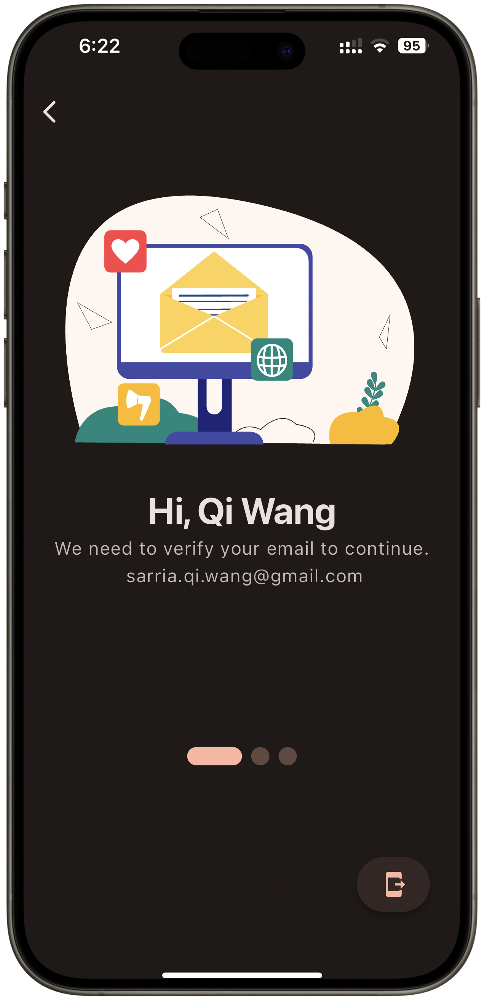
  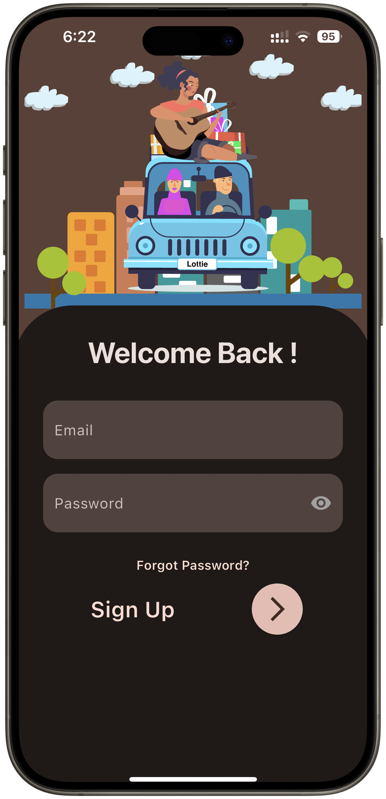
  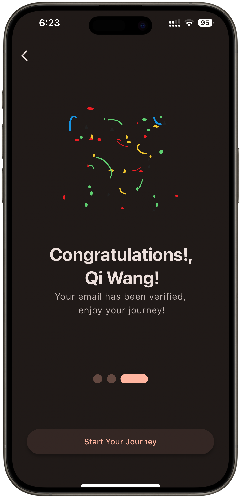

- Secure login and personalized settings for each user
- Email verification process
- Welcome back screen with email/password fields

### 2. Interactive Quiz Interface

  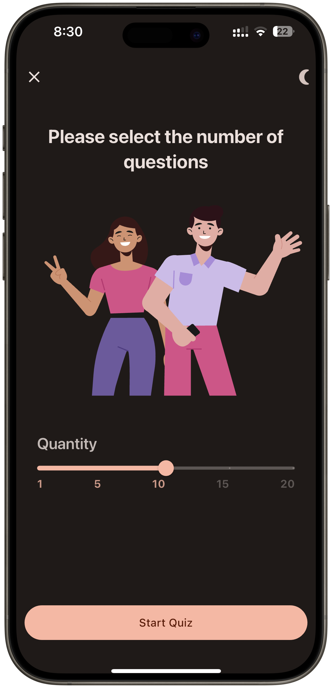
  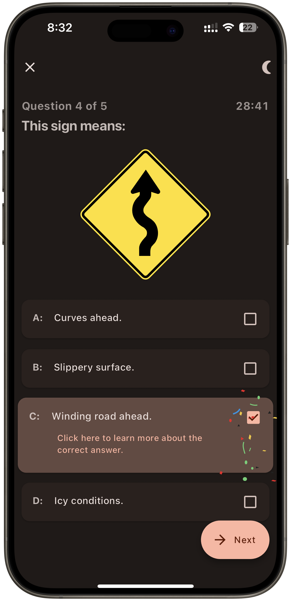
  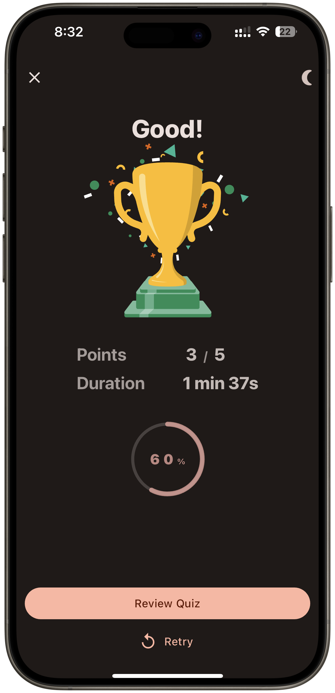

- Engaging interface with fun animations
- Multiple choice questions with visual feedback
- Score tracking and duration measurement
- Review option after quiz completion

### 3. Dynamic Color Themes

  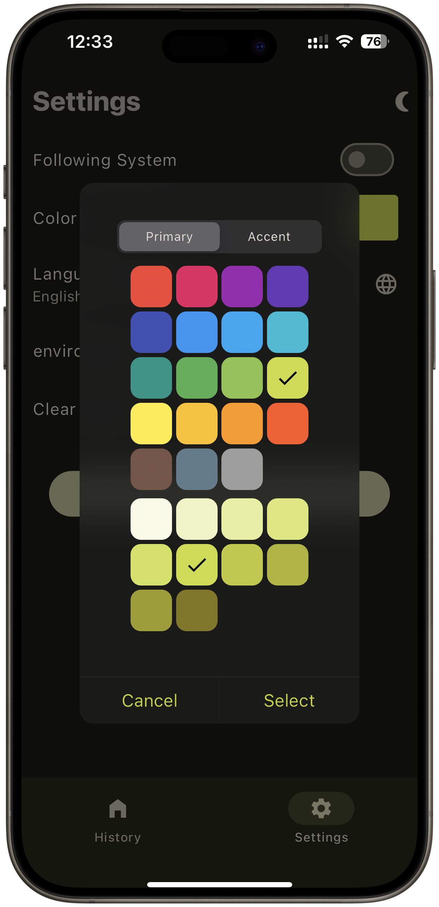
  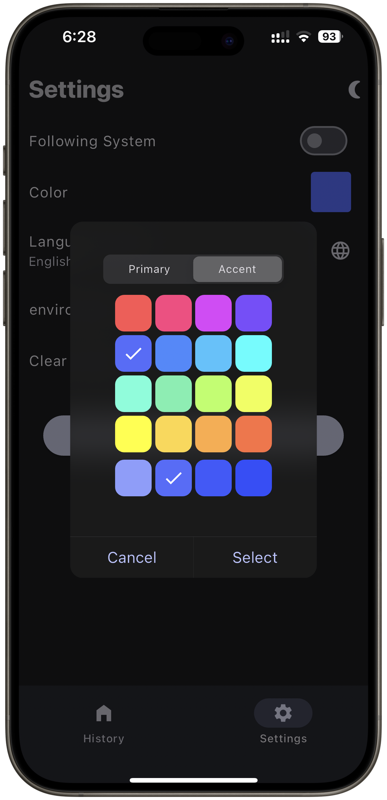
  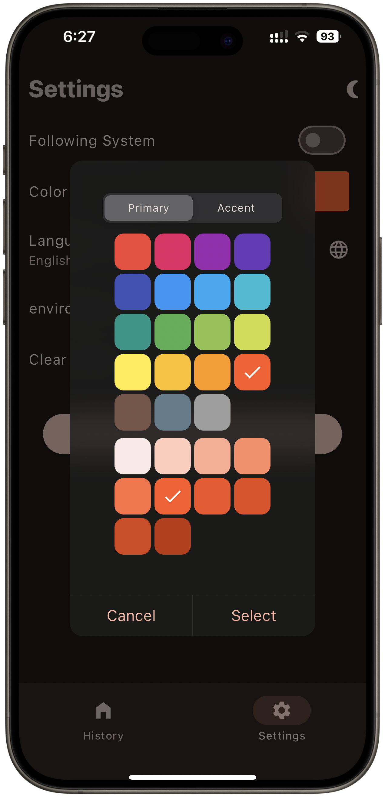

- Customizable app appearance with various color themes
- Primary and accent color selection
- Real-time preview of theme changes

### 4. History and Review

  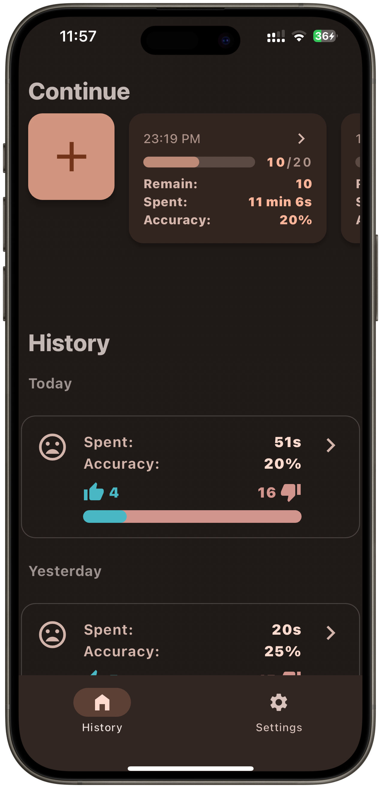
  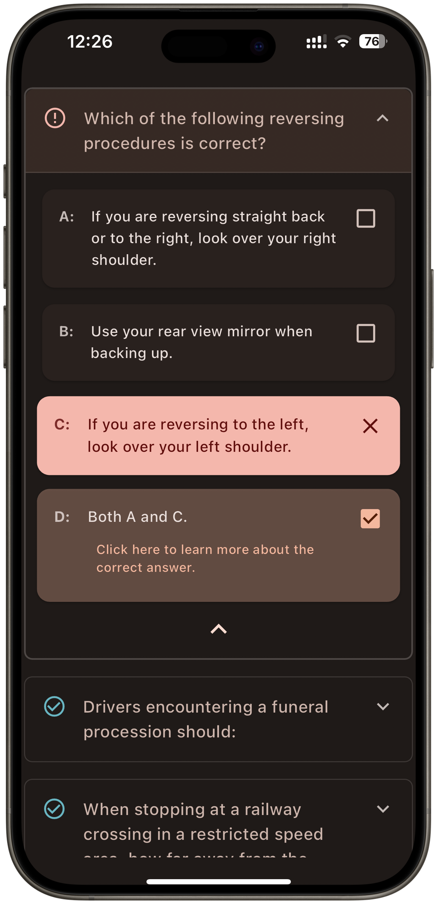
  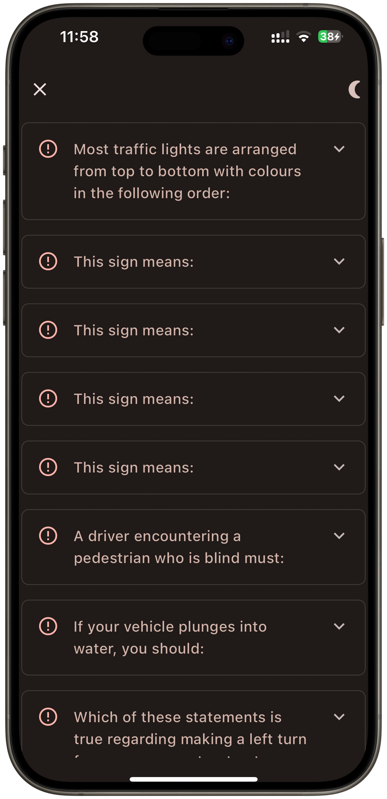

- Secure local storage of test history
- Detailed view of past quiz attempts
- Performance metrics including time spent and accuracy
- Option to review and learn from past quiz questions

## Design Highlights

- Dark mode interface for reduced eye strain
- Intuitive navigation with bottom tab bar
- Consistent use of iconography and typography
- Responsive layout adapting to different screen sizes

## Technical Implementation

- Firebase integration for user authentication
- Local database for storing quiz history
- Dynamic UI updates based on user interactions and settings
- Modular component design for easy maintenance and scalability